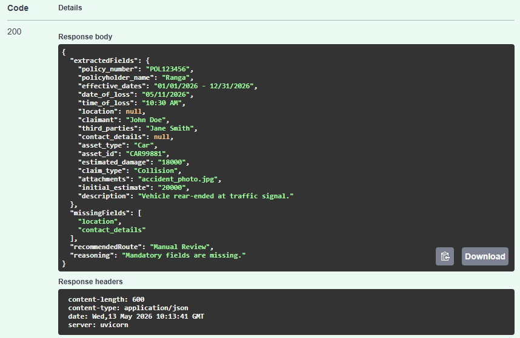

# Autonomous Insurance Claims Processing Agent

## Overview

This project is a lightweight AI-inspired insurance claims processing system that automates FNOL (First Notice of Loss) claim intake.

The system:

* Extracts structured information from TXT/PDF claim documents
* Validates mandatory fields
* Detects missing or suspicious information
* Routes claims to appropriate workflows
* Generates structured JSON responses

---

# Features

* PDF and TXT document support
* Field extraction engine
* Validation engine
* Intelligent routing system
* Fraud keyword detection
* Missing field detection
* REST API using FastAPI
* Swagger API documentation
* Logging and exception handling

---

# Tech Stack

* Python
* FastAPI
* pdfplumber
* Regex / Structured Parsing
* Uvicorn

---

# Project Structure

```bash
Insurance-agent/
│
├── app/
│   ├── main.py
│   ├── extractor.py
│   ├── validator.py
│   ├── router.py
│   ├── logger.py
│
├── docs/
│   ├── fast_track_claim.txt
│   ├── fraud_claim.txt
│   ├── injury_claim.txt
│   ├── missing_fields_claim.txt
│
├── uploads/
├── logs/
├── requirements.txt
└── README.md
```

---

# How to Run the Application

## Step 1 - Create Virtual Environment

```bash
python -m venv venv
```

---

## Step 2 - Activate Virtual Environment

### Windows

```bash
venv\Scripts\activate
```

### Linux / Mac

```bash
source venv/bin/activate
```

---

## Step 3 - Install Dependencies

```bash
pip install -r requirements.txt
```

---

## Step 4 - Run FastAPI Server

```bash
uvicorn app.main:app --reload
```

---

# Swagger API Documentation

Open the following URL in browser:

```text
http://127.0.0.1:8000/docs
```

Use Swagger UI to:

* Upload claim documents
* Test APIs
* View JSON responses


# Screenshots

## Swagger UI

